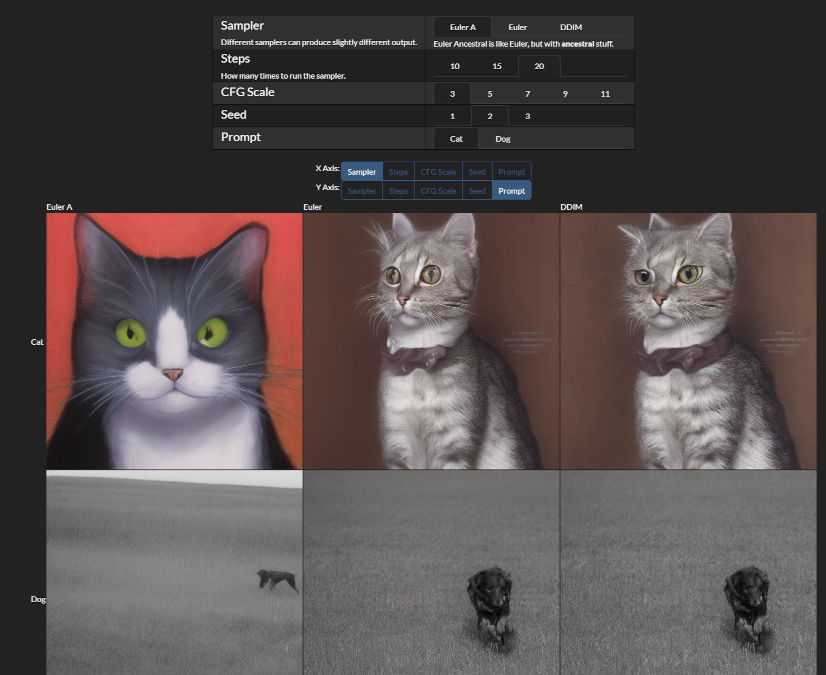
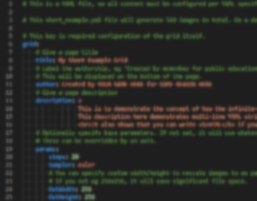
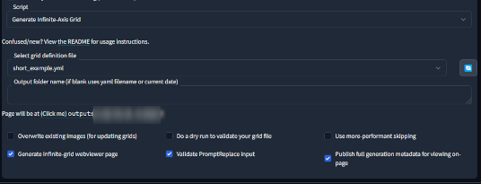
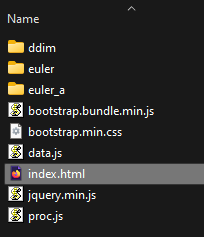

# Stable Diffusion Infinity Grid Generator


Extension for the [AUTOMATIC1111 Stable Diffusion WebUI](https://github.com/AUTOMATIC1111/stable-diffusion-webui) that generates infinite-dimensional grids.

An "infinite axis grid" is like an X/Y plot grid, but with, well, more axes on it. Of course, monitors are 2D, so this is implemented in practice by generating a webpage that lets you select which two primary axes to display, and then choose the current value for each of the other axes.

This design was partially inspired by the "XYZ Plot" script by "xrypgame". Sections of code are referenced from the WebUI itself, and its default "X/Y Plot" script.

Part of the goal of this system is to develop educational charts, to provide a universal answer to the classic question of "what does (X) setting do? But what about with (Y)?".

There is a built in ability to add description text to fields, for the specific purpose of enhancing educational page output.

The advantage of this design is it allows you to rapidly compare the results of different combinations of settings, without having to wait to generation times.

The disadvantage is that time to generate a grid is exponential - if you have 5 samplers, 5 seeds, 5 step counts, 5 CFG scales... that's 5^4, or 625 images. Add another variable and now it's 3125 images. You can see how this quickly jumps from a two minute render to a two hour render.

--------------

### Status

Works as intended, actively maintained. Has been tested by me, and has gotten some testing and feedback from the community. Could benefit from web design improvement (might need to find somebody with experience in this to help, I'm a programmer not a designer).

--------------

### Table of Contents

- [Examples](#Examples)
- [Installation](#Installation)
- [Usage](#Usage)
    - [1: Grid Definition File](#1-grid-definition-file)
    - [2: Grid Content Generation via WebUI](#2-grid-content-generation-via-webui)
    - [3: Using The Output](#3-using-the-output)
    - [Expanding Later](#expanding-later)
- [License](#License)

--------------

### Examples

Here's a big MegaGrid using almost every mode option in one, with detailed educational descriptions on every part: https://sd.mcmonkey.org/megagrid/

Here's a very small web demo you can try to test how the output looks and works: https://mcmonkeyprojects.github.io/short_example and you can view the generated asset files for that demo [here](https://github.com/mcmonkeyprojects/mcmonkeyprojects.github.io/tree/master/short_example).



--------------

### Installation

- You must have the [AUTOMATIC1111 Stable Diffusion WebUI](https://github.com/AUTOMATIC1111/stable-diffusion-webui) already installed and working. Refer to that project's readme for help with that.
- Open the WebUI, go to to the `Extensions` tab.
- Click on `Install from URL`
- Copy/paste this project's URL into the `URL for extension's git repository` textbox: `https://github.com/mcmonkeyprojects/sd-infinity-grid-generator-script`
- Click `Install`
- Restart or reload the WebUI

--------------

### Usage

Usage comes in three main steps:
- [1: Build a grid definition](#1-grid-definition-file)
- [2: Generate its contents](#2-grid-content-generation-via-webui)
- [3: View/use the generated output page](#3-using-the-output)

#### 1: Grid Definition File



- Grid information is defined by YAML files, in the extension folder under `assets`. Find the `assets/short_example.yml` file to see an example of the full format.
- You can create new files in the assets directory (as long as the `.yml` extension stays), or copy/paste an example file and edit it. I recommend you do not edit the actual example file directly to avoid git issues.
- I recommend editing with a good text editor, such as *VS Code* or *Notepad++*. Don't use *MS Word* or *Windows Notepad* as those might cause trouble.
- All text inputs allow for raw HTML, so, be careful. You can use `&lt;` for `<`, and `&gt;` for `>`, `&#58;` for `:`, and `&amp;` for `&`.
- The file must have key `grid`, with subkey `title` and `description` to define the file data.
    - It must also have `format` as `jpg` or `png`
    - It can optionally also have `params` to specify any default parameters.
- The file must have key `axes` to define the list of axes. This is a map-list key - meaning, add subkeys to create a list of each axis.
    - Each axis must have a `title`, and `values`. It can optionally have a `description`.
        - You can also optionally have `default: (value_id)` to set the default selected tab.
        - There are two ways to do a value in the value list:
            - Option 1: just do like `steps=10` ... this will set title to `10`, and param `steps` to value `10`, with no description.
            - Option 2: Add a submapping with key `title`, and optional `description`, and then `params` as a sub map of parameters like `steps: 10`
                - A value with a full format can be set to skip rendering via adding `skip: true`. This is useful for eg if some values are only valid in certain combinations, you can do runs with some skipped. Skipped values will be kept in the HTML output.

Micro example:
```yml
grid:
    title: Tiny example
    author: someone
    description: This is just to show core format rules. View the example `.yml` files in assets for better examples.
    format: jpg
axes:
    1:
        title: Sampler
        values:
            1: sampler=Euler
```

- Names and descriptions can always be whatever you want, as HTML text.
- Settings supported for parameters:
    - `Sampler`, `Seed`, `Steps`, `CFGscale`, `Model`, `VAE`, `Width`, `Height`, `Hypernetwork`, `HypernetworkStrength`, `Prompt`, `NegativePrompt`, `VarSeed`, `VarStrength`, `ClipSkip`, `Denoising`, `ETA`, `SigmaChurn`, `SigmaTmin`, `SigmaTmax`, `SigmaNoise`, `OutWidth`, `OutHeight`, `PromptReplace`
    - All names are case insensitive and spacing insensitive. That means `CFG scale`, `cfgscale`, `CFGSCALE`, etc. are all read as the same.
    - Inputs where possible also similarly insensitive, including model names.
    - Inputs have error checking at the start, to avoid the risk of it working fine until 3 hours into a very big grid run.
    - `OutWidth`/`OutHeight` are optional, and if specified, will rescale images to a specific size when saving. This is useful to save filespace by outputting to a smaller res.
    - `PromptReplace` can be used like `PromptReplace: some_tag = new text here`. Note the `=` symbol to separate the original text with the new text. That will change a prompt of for example `my prompt with some_tag stuff` to `my prompt with new text here stuff`
        - Unlike other modes, the PromptReplace is case-sensitive - if you use capitals in your prompt, you need capitals in your replace matcher.
        - If you want multiple replacements in one value, you can just do `PromptReplace` and `Prompt Replace` and `Prompt    Replace` and etc. as they are all parsed the same.
- Note that it will be processed from bottom to top
    - so if you have `samplers`, then `steps`, then `seeds`, it will:
        - choose one sampler and step count, and iterate all seeds.
        - then it will do the next sample and step count, and iterate all seeds.
        - once all seeds are done for that pair, it will retain the same sampler, and choose the next step count, then iterate all seeds.
        - etc. on repeat until all steps are done, then it will finally choose the last sample.
    - So, things that take time to load, like `Model`, should be put near the top.
- Note that `Model`, `VAE`, `Hypernetwork` are global settings, and as such you should not have an axis where some values specify one of those params but others don't, as this will cause an unpredictable model choice for the values that lack specificity.

#### 2: Grid Content Generation via WebUI



- Open the WebUI
- Go to the `txt2img` or `img2img` tab
- At the bottom of the page, find the `Script` selection box, and select `Generate Infinite-Axis Grid`
- Select options at will. You can hover your mouse over each option for extra usage information.
- Select your grid definition file from earlier.
    - If it's not there, you might just need to hit the Refresh button on the right side.
    - If it's still not, there double check that your file is in the `assets/` folder of the extension, and that it has a proper `.yml` extension.
- Hit your `Generate` button (the usual big orange one at the top), and wait.
- The output folder will be named based on your `.yml` file's name.

#### 3: Using The Output



- Find the `index.html` file
    - It's normally in `(your grid output directory)/(filename)/index.html`
        - The example file might output to `outputs/grids/short_example/index.html`
- Open the HTML file in a browser. Enjoy.
- If you want to share the content, just copy/paste the whole freakin folder into a webserver somewhere.
    - Or upload to github and make GitHub.io pages host it for you.
- You have a few different clickable options:
    - `Show descriptions of axes and values`: if you used descriptions, you can uncheck this box to hide them. Helps save space for direct viewing.
    - `Auto-scale images to viewport width`: this is handy for a few different scenarios
        - A: if your images are small and your screen is big, checking this option makes them bigger
        - B: if your images are so big they're going off the edge, checking this option makes them smaller
        - C: if checked, you can zoom in/out of the page using your browser zoom (CTRL + Mouse Wheel) to change the UI size without affecting the image size
            - if unchecked, you can zoom in/out to change the size of the images.
    - `Advanced Settings`: when clicked, it will open a dropdown with more advanced settings
        - 
        - `Auto cycle every (x) seconds`: you can set these to non-zero values to the grid automatically change settings over time. For example, if you set your "Seed" option to "3 seconds", then every 3 seconds the seed will change (cycling between the options you have in order). This was suggested by [itswhateverman in issue #2](https://github.com/mcmonkeyprojects/sd-infinity-grid-generator-script/issues/2).
        - `Show value`: you can uncheck any box to hide a value from the grid. Helps if you want to ignore some of the values and get a clean grid of just the ones you care about. This was suggested by [piyarsquare in issue #4](https://github.com/mcmonkeyprojects/sd-infinity-grid-generator-script/issues/4).
    - You can also click on any image to view it fullscreen and see its metadata (if included in output).

#### Expanding Later

If you want to add more content to a grid you already made, you can do that:

- Use the same `yml` file.
- You can add new values to an axis freely.
- If you remove values, they will be excluded from the output but pre-existing generated images won't be removed.
- You can add axes, but you'll have to regenerate all images if so.
    - Probably save as a new filename in that case.
- If you're just adding a new value, make sure to leave `overwriting existing images` off.

----------------------

### Licensing pre-note:

This is an open source project, provided entirely freely, for everyone to use and contribute to.

If you make any changes that could benefit the community as a whole, please contribute upstream.

### The short of the license is:

You can do basically whatever you want, except you may not hold any developer liable for what you do with the software.

### The long version of the license follows:

The MIT License (MIT)

Copyright (c) 2022 Alex "mcmonkey" Goodwin

Permission is hereby granted, free of charge, to any person obtaining a copy
of this software and associated documentation files (the "Software"), to deal
in the Software without restriction, including without limitation the rights
to use, copy, modify, merge, publish, distribute, sublicense, and/or sell
copies of the Software, and to permit persons to whom the Software is
furnished to do so, subject to the following conditions:

The above copyright notice and this permission notice shall be included in all
copies or substantial portions of the Software.

THE SOFTWARE IS PROVIDED "AS IS", WITHOUT WARRANTY OF ANY KIND, EXPRESS OR
IMPLIED, INCLUDING BUT NOT LIMITED TO THE WARRANTIES OF MERCHANTABILITY,
FITNESS FOR A PARTICULAR PURPOSE AND NONINFRINGEMENT. IN NO EVENT SHALL THE
AUTHORS OR COPYRIGHT HOLDERS BE LIABLE FOR ANY CLAIM, DAMAGES OR OTHER
LIABILITY, WHETHER IN AN ACTION OF CONTRACT, TORT OR OTHERWISE, ARISING FROM,
OUT OF OR IN CONNECTION WITH THE SOFTWARE OR THE USE OR OTHER DEALINGS IN THE
SOFTWARE.
